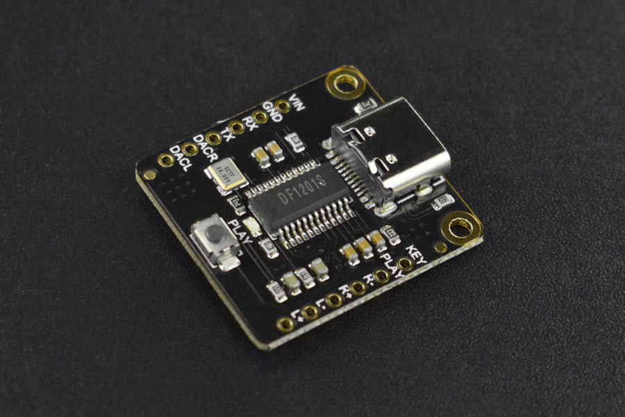

# Le réveil des oiseaux
En combinant une boîte qui diffuse le cri d'un oiseau avec des excursions ornithologiques, des petits déjeuners conviviaux et des ateliers interactifs, notre projet vise à créer une journée dédiée à la découverte et à la célébration des merveilles aviaires, tout en sensibilisant à la préservation de la biodiversité.

# Liste des pièces
| | |
| ----------- | ----------- |
||Le [DFPlayer Pro](https://wiki.dfrobot.com/DFPlayer_PRO_SKU_DFR0768) est un mini lecteur MP3 polyvalent, offrant quatre modes de contrôle : Arduino, commande AT, boutons intégrés et ADKEY. Avec 128 Mo de stockage intégré et un connecteur Type-C, il est facile à utiliser et offre une meilleure qualité audio. En outre, il propose des fonctions avancées telles que l'avance rapide, le retour rapide et la lecture à partir d'un point spécifique dans le fichier audio.
|| [Adafruit-1314](https://www.adafruit.com/product/1314) - Le haut-parleur de 3 pouces de diamètre est spécialement conçu pour offrir une impédance de 4 ohms et une puissance maximale de 3 watts. Ce haut-parleur est idéal pour une variété de projets audio où une qualité sonore fiable est essentielle. Son cône de haut-parleur de 3 pouces offre un son clair et précis, tandis que ses 4 supports de montage pratiques, espacés de 60 mm, facilitent son installation dans différentes configurations.
||L'extension de câble USB-C mâle vers femelle offre une connectivité pratique pour vos appareils USB-C. Avec ses 20 cm de longueur, ce câble compact prend en charge la transmission rapide de données et le chargement évolutif.
||Le bouton de pression mini R13-507 de Sesaat est conçu pour offrir une fonction de réinitialisation fiable dans les panneaux électriques de 16 mm. Avec ses 2 broches, il offre une puissance de 3A à 250VAC, garantissant une performance sécurisée et durable. Parfait pour les applications nécessitant un bouton compact et fiable.
||Ce bouton poussoir LED transparent offre un éclairage coloré et interactif pour les enfants. Fabriqué en plastique ABS de haute qualité, il est durable et résistant aux chocs.
||Le connecteur JST PH2 est une solution fiable pour les connexions électriques. Avec ses fils pré-soudés et son format compact, il offre une installation facile et sécurisée. Parfait pour les projets électroniques nécessitant une connexion stable et durable.